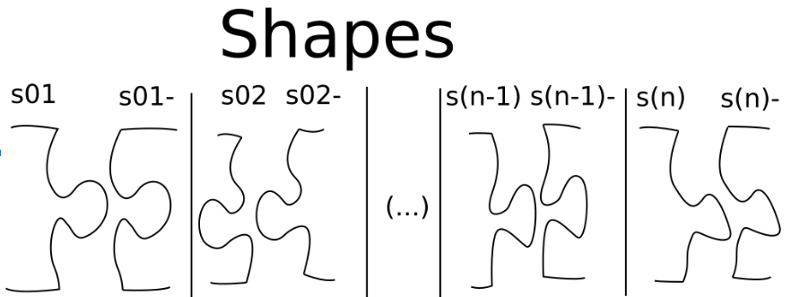
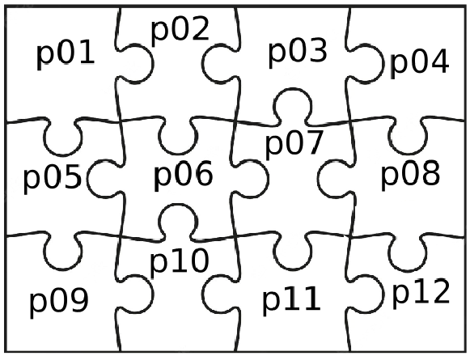
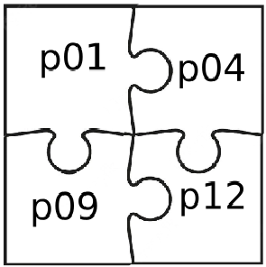
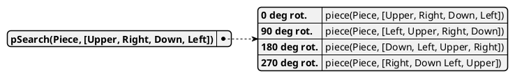

<span>Alternative computer architectures and programming languages report: Prolog</span>
<br>
<br>
<br>
<br>
<br>
<br>
<br>
<br>
<br>
<br>
<br>
# Jigsaw Puzzle Solver
<br>
<br>
<h3> Lu Knoblich </h3>
<br>
<br>
<br>
<div style="page-break-after: always"></div>


Table of contents
---

- [Jigsaw Puzzle Solver](#jigsaw-puzzle-solver)
  - [Table of contents](#table-of-contents)
  - [Description of problem and scope of the solution](#description-of-problem-and-scope-of-the-solution)
  - [Solution Procedure](#solution-procedure)
  - [Predicates](#predicates)
    - [Base Predicates](#base-predicates)
      - [**piece/2**](#piece2)
      - [**shapeMatch/2 and matchingShapes/2**](#shapematch2-and-matchingshapes2)
      - [**pSearch/2 and pieceSearch/3**](#psearch2-and-piecesearch3)
    - [Functional Predicates](#functional-predicates)
  - [Results of the model simulation and analysis](#results-of-the-model-simulation-and-analysis)
    - [State space analysis](#state-space-analysis)
      - [One employee, one roll](#one-employee-one-roll)


<br>
<br>
<br>
<br>

<div style="page-break-after: always"></div>


## Description of problem and scope of the solution

For this Project of the "Alternative computer architectures and programming languages" course, the goal was to solve a problem using Prolog.

I have decided to create a Prolog program that is able to solve jigsaw puzzles of any dimensions relying exclusively on the shape of the pieces to find matches  that can be connected to built the complete rectangular puzzle.


The creation of the puzzle will be performed using a python script that divides a rectangle into an X by Y matrix, where every two neighboring cells share a matching pair of shapes on the connecting sides. 
A pair of shapes is said to match if one is the inverse or complementary shape of the other.

In a real puzzle, this can be understood with the help of the following image, where any shape is has the inverted form of its matching shape.



The shape identification of the pieces of a real puzzle, would require an image of the pieces and for the edges to be analyzed as a curved edge to find a matching shape. This was considered to be outside the scope of this project. Instead, the exact shape of each piece will be assumed to be previously known, and each piece's side will be defined to a value from a discrete set of possible shapes, where each of them has a unique corresponding matching shape.

The number of possible shapes each piece's side can have will be limited as a function of the total number of pieces that form the final puzzle. Special consideration needed to be taken in order to define this.

If the number of possible shapes is too large, the amount of pieces that could match to another piece shape will be reduced down to being a single one. This would make the search for a puzzle solution trivial, since little to no backtracking will be necessary, as the search for a piece with the required shapes would potentially yield a single possible solution.

This was deemed unrealistic, since one of the inherent challenges posed by a jigsaw puzzle is having to backtrack a few steps due to finding a matching piece and later discovering that it produces a built section that can not be expanded to completion.

The opposite is also problematic. If the set of possible shapes is too low, there would be an increased number of possible solutions that would yield a rectangular built puzzle with the pieces in different locations, or only utilizing a subset of the available pieces.

An extreme example of this would be a puzzle of 3x3 or larger where all four corner match each other to produce a built rectangle of 2x2 pieces. 






A preliminary decision was made to use a 4x5 puzzle with a set of 10 possible matching shapes (20 in total. 10 shapes + 10 inverted shapes) during the development of this solver. This was later evaluated and the set of matching shapes was defined to be one 6th of the total number of pieces in the complete puzzle.


## Solution Procedure

The basic Procedure in order to find a solution is as follows:

The puzzle will be built one piece at a time from left to right to form each row, with the rows being built top to bottom. 

To begin each row, the connecting shape of the previous row is needed, and the current piece is set to be the left margin (starting piece). In the case of the first row, the shape of the upper row is set to be that of the margin. 

From the current piece, a new piece matching on its right side while also matching the first connecting shape from the row above is searched. Once it is found, this step is repeated recursively with the new piece as the current piece and the remaining shape of the previous row.

The end of this recursion is reached when the current piece is part of the margin, indicating the end of the row, and returning an empty list of pieces.

This is followed by each level of the recursion returning a list with its "current piece" on the front, followed by the list of pieces returned from the deeper recursion levels. The lower shapes of each piece is returned in the same manner.

This results in a list containing the built row, and the exposed shapes needed to connect the next row.

When a row is built, this procedure is repeated recursively to obtain the row below the current one.

The final row of the puzzle is detected when the bottom shape of the previous row matches the margin. This returns an empty list of rows.

Each recursion returns a list containing its "current row" followed by the rows below.


<!-- ## each recursion to find the next piece is started with left margin as the current piece
## each recursion to build the next row is started with the top margin as the previous/connecting row -->


## Predicates

The proposed procedure needs to be implemented in prolog using different predicates.

These predicates can be classified in two different groups according to their purpose:
    - Base predicates
    - Functional predicates

### Base Predicates

These predicates are the ones used to define the individual puzzle pieces, the matching edges and the puzzle margins and to be able to search for them.

#### **piece/2**
The pieces are declared in the following manner:

```prolog
piece(p01, [s00,s01,s02n,s00]).
% (...)

piece(marginLeft,[null,smargin,null,null]).
piece(margin2d,[smargin,smargin,smargin,smargin]).
piece(margin2d,[s00,smargin,smargin,smargin]).
```

This example starts with the definition of the upper left corner piece, where "p01" is the piece's name and is followed by the shape of its sides in the following order: Up, Right, Down and Left.

It is followed by the definition of the puzzle's left margin, the upper and lower margin, and lastly, the right margin. 
These had to be separated in order avoid matching two  margins pieces to one another when searching for a new piece, except for the right margin which may match below another margin piece, as it is required to trigger the end of a row.

#### **shapeMatch/2 and matchingShapes/2**

```prolog
shapeMatch(s00, smargin).
shapeMatch(s01, s01n).
shapeMatch(s02, s02n).
% (...)

matchingShapes(A, B) :- shapeMatch(B, A).
matchingShapes(A, B) :- shapeMatch(A, B).

```

The shapes with their corresponding match are defined using `shapeMatch/2`. To indicate that one shape is the inverse of the other, both will be named equally except for one of them ending with the letter `n` (standing for negative). Nevertheless, this match may not be unidirectional, so that either one of the pieces forming a match can be used to find the second one.

This is achieved through the predicate `matchingShapes/2`, which was kept as a separate predicate to avoid the endless loops that would occur if `shapeMatch(A,B):- shapeMatch(B,A).` had been used.


#### **pSearch/2 and pieceSearch/3**

While the individual pieces can be found using the piece/2 predicate, this would lead to them having a fixed orientation. If it were a real puzzle, it would be like all pieces having an arrow that is known to point upwards. This was considered to be an unrealistic representation of the problems posed by a jigsaw puzzle.

To allow the pieces to be randomly oriented and require the solver to "rotate" the pieces to find match, the following predicates were implemented:

```prolog
pSearch(P,[U,R,D,L]):- 
    between(0,3,N),
    pieceSearch(P,[U,R,D,L],N),
    P \= margin2d,
    P \= marginLeft.

% margin Pieces should not be rotated
pSearch(margin2d,[smargin,smargin,smargin,smargin]).
pSearch(margin2d,[s00,smargin,smargin,smargin]).
pSearch(marginLeft,[null,smargin,null,null]).

% different rotations
pieceSearch(P,[U,R,D,L],0):- piece(P,[U,R,D,L]).
pieceSearch(P,[U,R,D,L],1):- piece(P,[L,U,R,D]).
pieceSearch(P,[U,R,D,L],2):- piece(P,[D,L,U,R]).
pieceSearch(P,[U,R,D,L],3):- piece(P,[R,D,L,U]).
```

`pSearch` is responsible for attempting all possible orientations for pieces of the puzzle without rotating the margin pieces, since they need to be identified to allow the beginning and end conditions of each row and the complete puzzle.

`pieceSearch` declares the 4 different orientations each piece can have by rolling the shapes of the edges.




### Functional Predicates

```prolog
% No subsequent pieces if margin is reached
matchRight(margin2d,[],_,_,[],_).
% Assume margin for upper shape if none is given
matchRight(P,L,H,[],Dshape,RD):- 
    P \= margin2d,
    matchRight(P,L,H,[smargin],Dshape,RD).

%Piece, BuiltRow, Unavailable, UpperRowShape, currentRowBottomShape
matchRight(P,[P|PL],Unavailable, [D0|Tshape],[D|Dshape],[R,D]):- 
    P \= margin2d,  % check for margin
    pSearch(P,[_,R,D,_]),   
    matchingShapes(R, L2),  % get new piece`s required shapes
    matchingShapes(D0,U2),  
    pSearch(P2,[U2,R2,D2,L2]), % find piece that matches required shape
    not_member(P2,Unavailable),   % check if new piece is still available
    matchRight(P2,PL,[P2|Unavailable], Tshape, Dshape, [R2,D2]). % Find next match
```

```prolog
% thisRowAndBelow, previousRowShape, UnavailablePieces
solutionDownwards([SR1|SR2], SR0shape, Unavailable0):-
    not(lastRowShape(SR0shape)),
    matchRight(marginLeft, [_|SR1], Unavailable0, SR0shape, [_|SR1shape], _),
    union(Unavailable0, SR1, Unavailable1),
    solutionDownwards(SR2, SR1shape, Unavailable1).


solutionDownwards(SR1,SR0shape,_):-
    lastRowShape(SR0shape),
    SR1 = [].


solution(S):-
    solutionDownwards(S,[],[]).

lastRowShape([s00|_]).
```


## Results of the model simulation and analysis

### State space analysis

#### One employee, one roll


| Variance | Nodes | Arcs |
| :------: | ----: | ---: |
|    0     |   171 |  225 |
|    1     |  1007 | 1103 |
|    2     |  1476 | 1594 |


The results were three data sets.


| Number of employees | success rate with variance=0 | success rate with variance=1 | success rate with variance=2 |
| ------------------- | ---------------------------- | ---------------------------- | ---------------------------- |
| 1                   | 16.38%                       | 13.24%                       | 12.88%                       |
| 2                   | 74.64%                       | 75.34%                       | 75.48%                       |
| 3                   | 98.10%                       | 99.10%                       | 98.90%                       |
| 4                   | 98.96%                       | 99.89%                       | 99.70%                       |
| 5                   | 99.98%                       | 99.98%                       | 99.98%                       |
| 6                   | 100.00%                      | 100.00%                      | 100.00%                      |