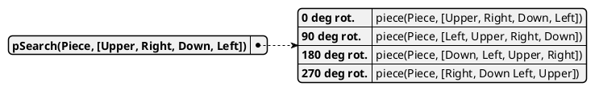
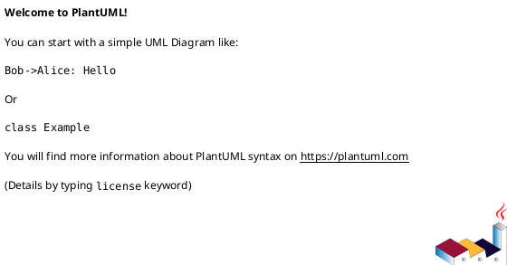

<style>
body { counter-reset: h1counter h2counter h3counter h4counter h5counter h6counter; }

h1 { counter-reset: h2counter; }
h2 { counter-reset: h3counter; }
h3 { counter-reset: h4counter; }
h4 { counter-reset: h5counter; }
h5 { counter-reset: h6counter; }
h6 {}

h2:before {
    counter-increment: h2counter;
    content: counter(h2counter) ".\0000a0\0000a0";
}

h3:before {
    counter-increment: h3counter;
    content: counter(h2counter) "." counter(h3counter) ".\0000a0\0000a0";
}

h4:before {
    counter-increment: h4counter;
    content: counter(h2counter) "." counter(h3counter) "." counter(h4counter) ".\0000a0\0000a0";
}

h5:before {
    counter-increment: h5counter;
    content: counter(h2counter) "." counter(h3counter) "." counter(h4counter) "." counter(h5counter) ".\0000a0\0000a0";
}

h6:before {
    counter-increment: h6counter;
    content: counter(h2counter) "." counter(h3counter) "." counter(h4counter) "." counter(h5counter) "." counter(h6counter) ".\0000a0\0000a0";
}

</style>


<span>AMS</span>
<br>
<br>
<br>
<br>
<br>
<br>
<br>
<br>
<br>
<br>
<br>

# Robot Desk Organizer

<br>
<br>

**Lu Knoblich, Christian Schmitz**

<br>
<br>
<br>
<div style="page-break-after: always"></div>


Table of contents
---
## [Jigsaw Puzzle Solver](#jigsaw-puzzle-solver)
### [Table of contents](#table-of-contents)
### [AMS Project Intro](#ams-project-intro)
### [References for Markdown](#references-for-markdown)


<div style="page-break-after: always"></div>


# Final Report Struktur

## Project Introduction

### Problem

### Solution

### What project environment?

#### Real life or simulation -> what simulation?

#### Pros and cons real life vs simulation

### Introduction Webots

## Solution Theory (given problems and proposed solutions)

### Milestones or steps needed in project development

#### Object detection

##### Idea how to solve problem,

##### first approach

##### Pros and cons

#### Coord transition

##### ..

#### Robot arm

##### ..

## Implementation (implementation of solutions -> going into detail at interesting places )

### Structure corresponds to chapter in solution theory

### Point out differences between previously planned solutions and actual implementation

### How it actually works

### Object detection

#### Trainigns image creation process description

#### Examples

### Coord transition

#### ..

### Robot arm

#### ..

## Results

### ..

## Outlook 

### same content as in presentation silde


## References for Markdown


```prolog
piece(p01, [s00,s01,s02n,s00]).
% (...)

piece(marginLeft,[null,smargin,null,null]).
piece(margin2d,[smargin,smargin,smargin,smargin]).
piece(margin2d,[s00,smargin,smargin,smargin]).
```


This is achieved through the predicate `matchingShapes/2`, which was kept as a separate predicate to avoid the endless loops that would occur if `shapeMatch(A,B):## shapeMatch(B,A).` had been used.







|**Call \ PuzzleSize**	|10	|25	|50	|75	|100	|125	|150    |
|:---	|-:	|-:	|-:	|-:	|-:	|-:	|-:    |
|$memberchk/3	|10.40%	|24.90%	|53.00%	|71.60%	|88.00%	|89.40%	|91.30% |
|piece/2	|49.30%	|37.50%	|24.60%	|13.40%	|5.70%	|5.00%	|4.50%  |
|matchRight/6	|25.40%	|5.00%	|4.00%	|2.60%	|0.90%	|0.60%	|0.40%  |
|pieceSearch/3	|0.00%	|16.30%	|5.40%	|2.20%	|0.80%	|1.00%	|0.60%  |
|pSearch/2	|4.50%	|5.30%	|3.50%	|3.40%	|1.00%	|0.90%	|0.70%  |

