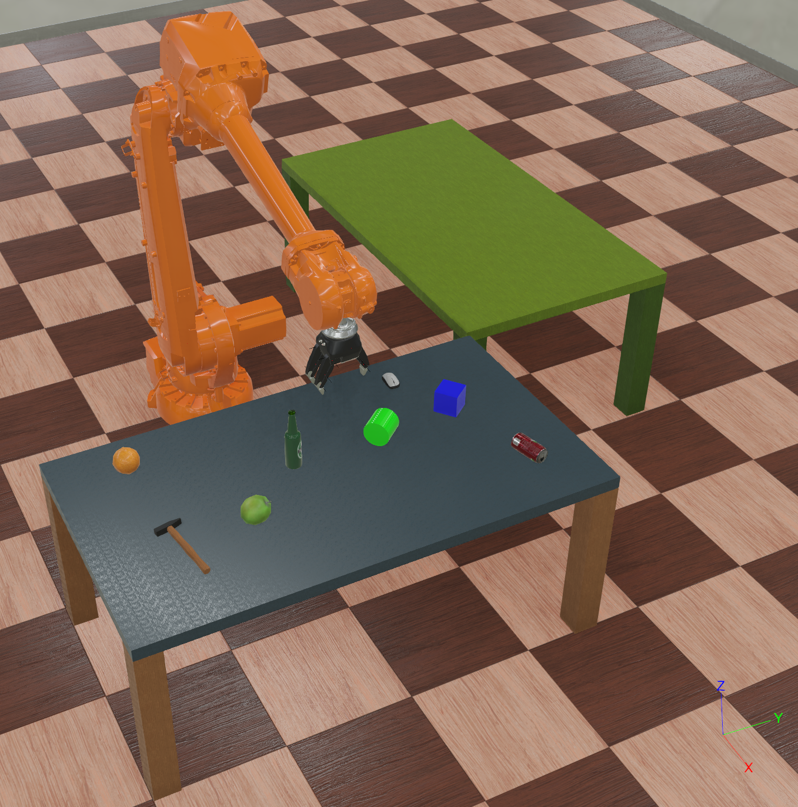
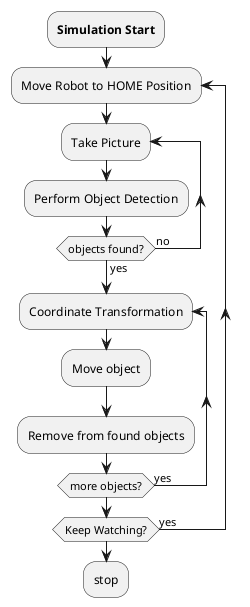
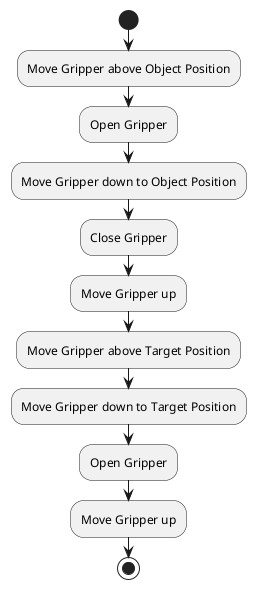
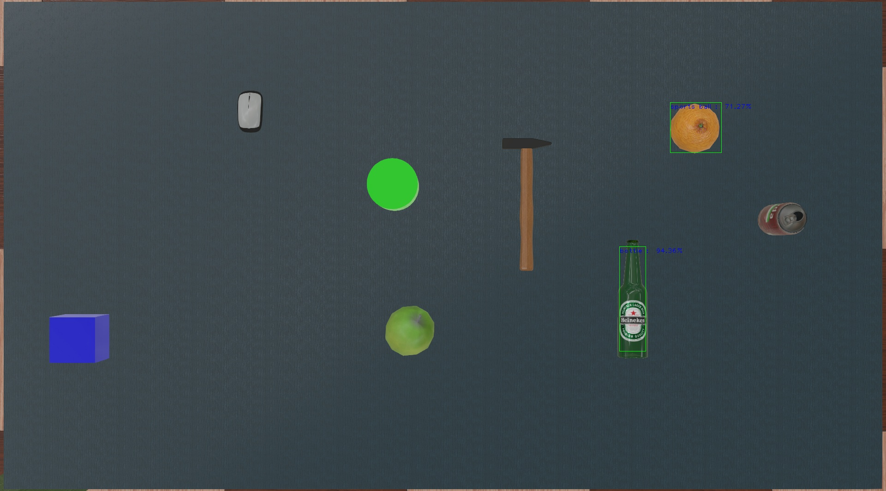
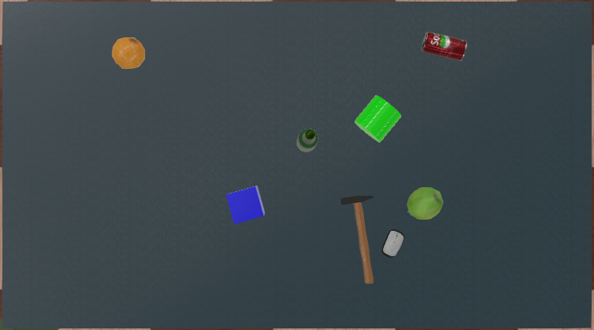
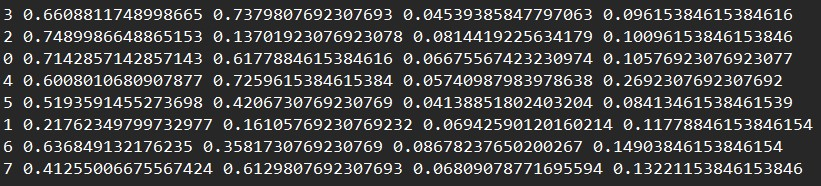
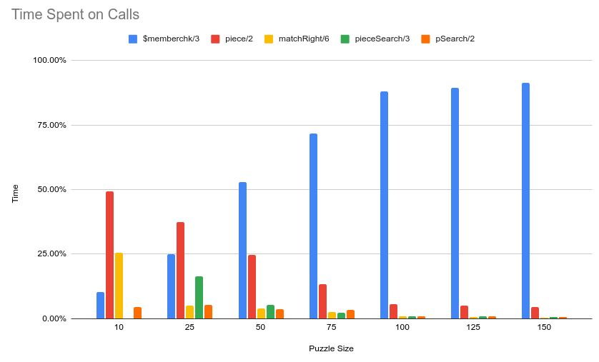
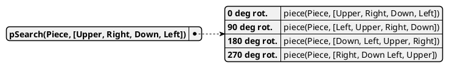
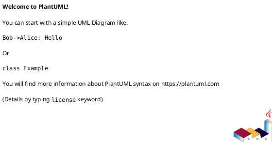

<style>
body { counter-reset: h1counter h2counter h3counter h4counter h5counter h6counter; 

    //font-size: 12px;
}

h1 { counter-reset: h2counter; }
h2 { counter-reset: h3counter; }
h3 { counter-reset: h4counter; }
h4 { counter-reset: h5counter; }
h5 { counter-reset: h6counter; }
h6 {}

h2:before {
    counter-increment: h2counter;
    content: counter(h2counter) ".\0000a0\0000a0";
}

h3:before {
    counter-increment: h3counter;
    content: counter(h2counter) "." counter(h3counter) ".\0000a0\0000a0";
}

h4:before {
    counter-increment: h4counter;
    content: counter(h2counter) "." counter(h3counter) "." counter(h4counter) ".\0000a0\0000a0";
}

h5:before {
    counter-increment: h5counter;
    content: counter(h2counter) "." counter(h3counter) "." counter(h4counter) "." counter(h5counter) ".\0000a0\0000a0";
}

h6:before {
    counter-increment: h6counter;
    content: counter(h2counter) "." counter(h3counter) "." counter(h4counter) "." counter(h5counter) "." counter(h6counter) ".\0000a0\0000a0";
}

.center-div {
    text-align:center;
}

.center-image {
    display:block; 
    margin:auto;
}

.image-description {
    font-size: 11px;
}

.sub-header {
    font-weight: bold;
}

pre code {
  font-size: 12px;
}

red {
    color: rgb(255, 0, 0);
}

</style>


<span>AMS</span>
<br>
<br>
<br>
<br>
<br>
<br>
<br>
<br>
<br>
<br>
<br>

# Robot Desk Organizer

<br>
<br>

**Lu Knoblich, Christian Schmitz**

<br>
<br>
<br>
<div style="page-break-after: always"></div>

# Abstract
- TODO Abstract
<div style="page-break-after: always"></div>

# Table of Content
- [Robot Desk Organizer](#robot-desk-organizer)
- [Abstract](#abstract)
- [Table of Content](#table-of-content)
- [Report: Autonomous workplace organizer](#report-autonomous-workplace-organizer)
  - [Introduction](#introduction)
  - [Project introduction](#project-introduction)
  - [Solution Theory (given problems and proposed solutions)](#solution-theory-given-problems-and-proposed-solutions)
    - [Object detection](#object-detection)
    - [Coordinates transformation](#coordinates-transformation)
      - [Transformation Matrix](#transformation-matrix)
    - [Robot controller](#robot-controller)
      - [Robot Kinematics](#robot-kinematics)
      - [Gripper Actuation](#gripper-actuation)
      - [Organization Routine](#organization-routine)
    - [Notes for this chapter (to be deleted later)](#notes-for-this-chapter-to-be-deleted-later)
  - [Implementation](#implementation)
    - [Object detection](#object-detection-1)
      - [First approach](#first-approach)
      - [Second approach / Solution](#second-approach--solution)
      - [Training data](#training-data)
      - [Training](#training)
      - [Result](#result)

<div style="page-break-after: always"></div>

<!-- ## [Introduction](#introduction)
## [Project introduction](#project-introduction)
## [Solution Theory (given problems and proposed solutions)](#solution-theory-given-problems-and-proposed-solutions)
### [Object detection](#object-detection)
### [Coord transition](#coord-transition)
### [Robot arm](#robot-arm)
## [Implementation](#implementation)
### [Object detection](#object-detection-1)

### [Coord transition](#coord-transition-1)
     
### [Robot arm](#robot-arm-1)
     
## [Results](#Results)
    
## [Outlook](#outlook)

### [same content as in presentation silde](#same-content-as-in-presentation-silde)
## [References for Markdown](#references-for-markdown) -->


# Report: Autonomous workplace organizer

## Introduction

The purpose of this project is to address the problem of an cluttered work space.
The solution we developed is a robotic arm that is designed to clean up and organize the work area. 
In this report we will document and discuss the development process of the project. 

The report is comprised of three sections. The first part provides a general introduction to the Project, where the project idea as well as technology used will be addressed. The main section of this report is divided into two chapters: "Solution theory" and "Implementation".
The "Solution Theory" chapter addresses the problems that needed to be solved in order to realize the project and the corresponding theoretical solutions for these problems. 
The "Implementation" chapter provides detailed explanations of how the solutions were actually implemented and draws a comparison between the theoretical solution and the actual implementation. Finally, the last part of the report focuses on the project results and provides a conclusion, evaluating whether we have achieved our project goals and discussing further improvements for the project as well as learning outcomes. 

## Project introduction

The objective of the project is to create a robotic system capable of tidying and arranging a workspace. The design incorporates a camera that identifies objects within the area, which the robotic arm then grasps and relocates to a designated spot.

- prove of concept for varios real world application
- Solution transferable to other use cases

In the initial phases of the project, the decision was made to utilize a simulation rather than a physical robot. This choice was made due to the ease of testing and development in a simulated environment. The Webots simulation platform was selected for its compatibility with the project, as it is an open-source simulation platform utilized for research and education purposes. The platform is based on the ODE physics engine and the OpenGl graphics library, and offers a broad array of sensors and actuators that can be utilized to develop a robot. Furthermore, Webots integrates various existing robot-devices so that the developed controllers can be used in the real world applications. We chose to use the Irb4600 robot, which is a six-axis industrial robot that is widely used in industry. Additionally the Webots API is provided in various programming languages, including C++, Python, Java, and Matlab. Due to the machine learning and computer vision components of the project, we decided to use Python to implement the developed solution, as it is widely supported in computer vision and machine learning applications. Git was used to manage the project and to facilitate collaboration between the team members.


<div class="center-div">
  
  <p class = "image-description">Figure 1: Project setup in Webots </p>
</div>

Figure one shows the project setup in Webots. A camera is used to detect objects in the workspace. The robot-arm is equipped with a gripper that can be utilized to grasp objects. The robot and its devices are controlled by a controller that is responsible for detecting objects, determining the robot's movement, and controlling the gripper. The entire system is self contained and doesn't require human interaction, other devices or an active web connection.

The system was developed by a team of two students and divided into three main components: object detection, coordinate transformation, and robotic arm control. 


## Solution Theory (given problems and proposed solutions)

This chapter addresses the solution concepts for the problems that needed to be solved in order to realize the project and is structured according to the previously mentioned main components of the project: object detection, coordinate transformation, and robotic arm control. 
 
### Object detection
The first component of the project is the object detection. Its purpose is to detect objects in the workspace and determine their relative coordinates and size in the image as well as their orientation in relation to the table. 

To simplify these problems, we decided to use a top-down view of the workspace. This means that the camera is positioned above the workspace, so that a linear correlation between the image and the table coordinates emerges. At the early stages of project development the training of a custom object detection model was not intended and it was planned to utilize an existing model. The YOLOv3 model, a convolutional neural network that is trained to detect objects in images, was selected due to its wide array of object classes and its high performance.

To detect the orientation of an object relative to the table, we decided to use OpenCV, a python library used in computer vision applications which provides a broad array of functions for image processing. The main idea was to determine the contours of the object by converting the image into the HSV color space and applying different filter. The contours are then used to calculate the main orientation of the object, using principle component analysis. 

### Coordinates transformation

Once the objects are detected, the next step is to determine their coordinates in the simulation. 

- TODO: first / theoretical approach to solve problem(s)

Once knowing the coordinates of the detected object in the image, 
the next step is to transform the objects position vector from the image's coordinate system to the world's coordinate system. This type of transformation is best achieved with the use of a transformation matrix.
<!-- the next step is to determine the coordinates of the object in the simulation environment so that its position relative to the robot arm can be used. -->

#### Transformation Matrix

A transformation matrix can be represented as a matrix frame, built from a combination of a rotation matrix, a translation vector, a scaling vector and a perspective projection matrix.

$$
\mathbf{T} = \left[
\begin{array}{ccc|c}
\ast&\ast&\ast&\ast\\
\ast&R   &\ast& T  \\
\ast&\ast&\ast&\ast\\
\hline
\ast&P   &\ast& S
\end{array}
\right]
$$
where:  
* $R$ is the rotation matrix with the dimensions $3\times 3$.  
* $T$ is the translation vector with the dimensions $3\times 1$.  
* $P$ is the perspective projection matrix with the dimensions $1\times 3$.  
* $S$ is the scale factor with the dimensions $1\times 1$ (for uniform or isotropic scaling).

The rotation matrix for a rotation around any given axis given by the unit vector $\mathbf{\vec{u}(x,y,z)}$ by an angle $\theta$ is given by the following formula:

$$
R =
\begin{bmatrix}
u_x^2(1-\cos\theta) + \cos\theta & u_xu_y(1-\cos\theta) - u_z\sin\theta & u_xu_z(1-\cos\theta) + u_y\sin\theta \\
u_xu_y(1-\cos\theta) + u_z\sin\theta & u_y^2(1-\cos\theta) + \cos\theta & u_yu_z(1-\cos\theta) - u_x\sin\theta \\
u_xu_z(1-\cos\theta) - u_y\sin\theta & u_yu_z(1-\cos\theta) + u_x\sin\theta & u_z^2(1-\cos\theta) + \cos\theta \\
\end{bmatrix}
$$


The translation vector is the position of the origin from image's coordinate system in the global simulation's coordinate system, i.e. the distance between both origins given as a three dimensional vector. 

$$
T =
\begin{bmatrix}
x\\
y\\
z\\
\end{bmatrix}
$$

The perspective projection matrix is not used in this project due to the camera orientation being perpendicular to the surface of intereset, but is included for completeness.

The scaling factor as given by the frame above can only be used for isotropic scaling, i.e. scaling in all three dimensions by the same factor. Since we are only interested in scaling in the x and y directions by different amounts, a single scaling factor can not be used by itself and needs to be expanded to a scaling matrix $\mathbf{S}$ with the following form:

$$
\mathbf{S}=
\begin{bmatrix}
S_x & 0 & 0   & 0\\
0 & S_y & 0   & 0\\
0 & 0   & S_z & 0\\
0 & 0   & 0   & 1
\end{bmatrix}
$$


where $S_x$, $S_y$ and $S_z$ are the scaling factors in the x, y and z directions respectively.

With the rotation and translation matrices a temporary Transformation matrix $T_{tmp}$ is built as the frame described previously using the unit 1 as a scaling factor. 

The resulting matrix is then multiplied with the sacling matrix  to obtain the final transformation matrix $T$ as follows. 

$$\mathbf{T} = \mathbf{T_{tmp}} \bullet \mathbf{S}$$
<!-- 
<red> The following is not complete, needs to be reworked and checked </red>

This is done by dividing the dimensions of the table in the simulation by the dimensions of the table in the image. Knowing this, it is possible to generate a transformation matrix

The first step is to determine the dimensions of the table in order to calculate the scale factor between the image and the simulation. Knowing the scale factor, it is necessary to determine the position and orientation of the table, in order to complete the transformation matrix that needs to be use to calculate the coordinates of the object in the simulation.

A transformation matrix is a 4x4 matrix that is used to transform a vector from one coordinate system to another. The transformation matrix is calculated by multiplying the translation matrix, the rotation matrix, and the scale matrix. The translation matrix is used to translate the vector from the origin of the coordinate system to the desired position. The rotation matrix is used to rotate the vector around the origin of the coordinate system. The scale matrix is used to scale the vector to the desired size.


In order to tranform the coordinates from the unit `pixels` to the unit `meters`, the scale matrix is calculated as follows:

$$
\begin{bmatrix}
 width & 0 & 0 & 0 \\
 0 & height & 0 & 0 \\
 0 & 0 & depth & 0 \\
 0 & 0 & 0 & 1 \\
\end{bmatrix}
$$

where `width`, `height`, and `depth` are the dimensions of the table in the simulation. -->

### Robot controller

Additionally, a robot-controller needs to be developed to control the robotic arm and the gripper.

- TODO: first / theoretical approach to solve problem(s)
  
These components will then be integrated into a single routine to detect objects, maneuver the robotic arm to the objects, and relocate the objects to a specified location.

#### Robot Kinematics

The Robot chosen for this task consists of a robotic arm with a gripper on the end of the arm. Without the gripper, the robot has 6 degrees of freedom.
Calculating the position of the gripper (the end effector) while knowing the position of each individual motor can be done using a process called forward kinematics, which combines multiple applications of trigonometric formulas.

Nonetheless, the reverse operation, which aims to calculate the required position of the joints in the kinematic chain given the (desired) position of the end effector presents a more challenging problem. Since the point to which the robot needs to move is defined as a three dimensional vector, it leaves 3 independent parameters, meaning there can be more than one solution for a given point.


To go around this problem, it is possible to use inverse kinematics

One option would be to use inverse kinematics to aproximate the required result.

<red>explain ik in depth</red>

Since the direction from which the robot is approaching the objects needs to be from above, some of the robots axis can be fixed to a predefined position. This reduces the number of degrees of freedom to 3, which makes it possible to use trigonometry to calculate the required position values for the remaining motors.

The following figure shows the robot's coordinate system and the position of the objects in the simulation.

<red>Insert figure from presentation</red>

The position of the first motor $\omega_0$ can obtained as the angle between the two dimensional position vector in the xy plane with $\omega_0=arctan(\frac{y}{x})$, where 
$y$ and $z$ are the y and z coordinates of the object in the simulation.


#### Gripper Actuation

The gripper consists of three individual fingers, each of them having three joints. The closing action of the finger is achieved by rotating the first joint of each finger until the desired object is grabed or the maximum joint rotation is reached. This alone creates a claw like grip, since all finger sections rotate with the first joint relative to the global coordinates. While useful in some cases, its contact area with the object being grabbed is significantly reduced.

In order to improve the contact area of the gripper, it is possible to rotate the third joint of each finger in the opposite direction by the same amount as the first one, compensating the rotation on the fingertips and creating a more stable grip.

The following figure shows the gripper in the open and closed position using the a claw and a pinch grip respectively.

<red>insert figure of gripper open, closed claw and closed flat</red>


#### Organization Routine

With the information regarding the objects' position and orientation in the simulation, the following step is to control the robots movement to produce the desired behavior. The robot controller is implemented in Python and uses the Webots API to control the robot. The robot controller is responsible for the following tasks:

Initialization of the robot instance and the devices attached to it: 
* camera
* gripper
* internal variables
* Motor sensors
* Motor actuators

Coordination of the robot's movement.
Coornidation of the different steps required for the organization process.
* Reding the camera's image and forwarding the data to the object detection module.
* Reading the object detection module's output and forwarding the data to the coordinate transformation module.
* Reading the coordinate transformation module's output and forwarding the data to the robotic arm control module.
* Perform the movement as required for the detected objects positions
  







### Notes for this chapter (to be deleted later)
- Milestones or steps needed in project development
- We define which problems we needed to solve and our first approaches to solve these problems

## Implementation 
In this chapter we will describe the implementation of the solutions proposed in the previous chapter. Additionally, there will be a comparison between the theoretical solution and the actual implementation as well as a discussion of the difficulties that were encountered during the development process. The chapter is structured according to the previously mentioned main modules of the project: object detection, coordinate transformation, and robotic arm control.
### Object detection

#### First approach
The first approach to solve the problem of object detection was to use the YOLOv3 model. The model was trained on the COCO dataset, which contains 80 different object classes. During the early stages of development we setup a test scenario in Webots, where we placed various objects in the workspace and used the YOLOv3 model to detect the objects. 

Figure 2 shows the results of the object detection using the YOLOv3 model. The following objects on the workspace are included in the COCO dataset and should therefore be detectable by the model: computer mouse, apple, beer can and orange. The camera perspective in this test scenario was similar to the perspective in the final project setup.  

<div class="center-div">
  
  <p class = "image-description">Figure 2: Object detection results YOLOv3 model </p>
</div>


The model was able to detect the beer can with an accuracy of 94 percent. However, the orange only had a likelihood of 71 percent whereas the apple and the computer mouse were not detected at all. Although the model was able to identify the beer can the overall performance was not satisfactory and another solution was needed.

#### Second approach / Solution

The second approach to solve the problem of object detection was to train a custom model. In the project plan, it was not initially planned to train an own model. However, to streamline the process, the decision was made to utilize the ImageAI library, a python library that offers a convenient framework for training and utilizing object detection models. [1]

In order to reduce the effort needed to train the model, we decided to use transfer learning, which is a machine learning method where a model, trained on a large dataset, is used as a starting point for a new model. The new model is then trained, containing the pre-trained weights of the origin model. [2] We chose to use the pre-trained YOLOv3 model, mentioned above, as the basis for transfer learning. 

#### Training data 

The first step to train a custom model is to gather and arrange the training data in the YOLO annotation format. In this format the data is divided into two main directories: "train" and "validation". Each of these directories contains two sub-directories: "images" and "annotations". It's recommended to use 80% of the data for training and 20% for validation. The data consists of both images of objects we want to detect and accompanying annotation files. Each image is linked with a corresponding annotation file that shares the same name as the image file and provides information about the objects in the image. The general structure of the object annotation is shown below. 

```prolog
<object-class><x-pos><y-pos><width><height>
```	
The file contains one line for each object in the image. The object class is an integer that represents the type of the object. The value corresponds to a list of objects in another file named "classes.txt" inside the "annotation" directory and is encoded by the index of the object in the list. The x-pos, y-pos, width, and height are the information for the bounding box of the object in the image. The values are normalized to the range [0, 1] and are relative to the width and height of the image.

<p class = "sub-header">Automatization</p>

Instead of creating and labeling the images manually we decided to automate the process. The plan was to utilize the object detection feature integrated in Webots to automatically generate the image and annotation files within their respective directories. We only utilized this detection method to create training data, as the detection is not based on image recognition but hard coded within Webots. 

Two configurations were set up to generate training data. The first setup produces data with a top-down camera view and multiple objects arranged on the table. The second setup generates images with individual objects positioned on the table at different orientations and rotated camera at four distinct viewpoints.

<p class = "sub-header">Configuration 1: Top down</p>

The initial step in realizing the top-down configuration involved the definition of a function for capturing camera images and generating the corresponding annotation files. This function utilizes a reference of the camera object to obtain the objects currently detected, determine the values needed for annotation and store the images and annotation files in their designated directories. The following code segment demonstrates a shortened version of the implementation of this function.

```python
1 def createTrainingFiles(camera,type = "train"):
2    ... # initialize variables and generate pathes
3    while True: # get current fileName
4       filename = f"image_{fileNamePostfix}.txt"
5       filepath = os.path.join(annotationPath, filename)
6       if not os.path.isfile(filepath): 
7           break # if file does not exist, use this name
8       fileNamePostfix += 1
9   fileName = f"image_{fileNamePostfix}"
10  for obj in recognizedObjectes:
11      id = obj.getId()
12      name = obj.getModel()
13      if name not in categories:
14          continue
15      position = list(obj.getPosition())
16      positionOnImage = list(obj.getPositionOnImage())
17      orientation = list(obj.getOrientation())
18      size = list(obj.getSize())
19      sizeOnImage = list(obj.getSizeOnImage())
20      relativeSize = [sizeOnImage[0]/imageWidth, sizeOnImage[1]/imageHeight]
21      relativePosition = [positionOnImage[0]/imageWidth, positionOnImage[1]/imageHeight]
22      yoloData.append(f"{categories.index(name)} {relativePosition[0]} {relativePosition[1]} {relativeSize[0]} {relativeSize[1]}\n")
23      jsonData.append({
24          "id": id,
25          ... # adding the remaining properties to json data
26      })
27  camera.saveImage(imagePath+fileName+".jpg",100) # save image
28  with open(jsonPath+fileName+".json", 'w') as file: # save json data
29      json.dump(jsonData, file, indent=4)   
30  with open(annotationPath+fileName+".txt", 'w') as file: # save yolo annotation
31      file.writelines(yoloData)
```
The function accepts two parameters, a reference to the camera object, and a "type". The purpose of the "type" parameter is to specify whether the function should generate training or validation data. The function starts by initializing various variables and generating file paths for the image, annotation, and JSON data. In addition to the required training data, all available information about an object was saved in a JSON file so that it can be used later. The JSON file shares the same name as the image file and is stored in the directory "raw_data". Lines 3-8 determine the current file name for the output files. The filename is generated by appending a postfix to the string "image". The postfix is generated by incrementing a counter until a file with the generated name does not exist. This ensures that the file name is unique and does not overwrite existing files.
At line 10 a loop iterates over the objects that the camera recognizes, and collects information about each object, including its model name, position and size. These values are converted into the required format, by determining the object's relative position and size. Subsequently, in lines 22 and 23, Strings for the annotation and the JSON representation of the detected object are prepared so they can be appended to the corresponding lists for this image. Finally, the function saves the image, JSON data, and YOLO annotation data to their respective files using the file name generated earlier. The image is saved using the "camera.saveImage" function.

After a snapshot was taken the object's position and orientation on the table needed to be randomized. The corresponding function is shown below.

```python
1 def moveTableNodes(supervisor,table):
2    margin = 0.1
3    bottomLeft = table.local2world([0,1,0])
4    topRight = table.local2world([1,0,0])
5    x_min = bottomLeft[0] + (topRight[0] - bottomLeft[0]) * margin
6    x_max = topRight[0] - (topRight[0] - bottomLeft[0]) * margin
7    y_min = bottomLeft[1] + (topRight[1] - bottomLeft[1]) * margin
8    y_max = topRight[1] - (topRight[1] - bottomLeft[1]) * margin
9   for cat in categories:
10       obj = supervisor.getFromDef(cat)
11       x = random.uniform(x_min, x_max)
12       y = random.uniform(y_min, y_max)
13       z = bottomLeft[2] # any z coordinate
14       obj.getField('translation').setSFVec3f([x, y, z])
15       xRotation = random.uniform(1, 360)
16       yRotation = random.uniform(1, 360)
17       zRotation = random.uniform(1, 360)
18       angle = random.uniform(1, 360)
19       obj.getField('rotation').setSFRotation([xRotation,yRotation,zRotation,angle])

```
The function accepts two parameters: a reference to the supervisor object and a reference to the table object. The function begins by determining the boundaries of the table using coordinate transformation. Intervals for the x and y coordinates are determined for the random positioning of objects on the table and then adjusted to leave a margin of 0.1 meters around it. At line 9 a loop iterates the objects on the table and generates a random position and orientation for each object using the previously calculates intervals.

Finally a loop needed to be developed to call the snapshot and object randomization functions a specified number of times with a certain delay between each iteration. A decorator was used to extend the function to be repeatedly called until a specified condition is met while advancing the simulation. The following code segment demonstrates the implementation of this loop. 

```python
@looper
1 def randomPosSamplingLoop(self,sampleSize,type):
2     if self.loopCount % 10 == 0:
3         if self.loopCount % 20 == 0:
4             TrainingsHelper.moveTableNodes(self.supervisor,self.mainTable)
5         else:
6             TrainingsHelper.makeSnapshot(self.camera,type)
7             self.dataCount +=1
8     self.loopCount += 1
9     if self.dataCount>sampleSize:
10        return -1
```
The function takes two arguments as input: the quantity of samples, and the type of data, to be generated. In operation, the function initiates the execution of the "moveTableNodes" function at regular intervals of 20 iterations, ensuring the repositioning and reorientation of the objects every 2 seconds. Additionally, the "makeSnapshot" function is called every 10 iterations to secure the capturing of snapshots at a rate of once per second. The function concludes its operation by returning a value of -1 when the predetermined number of samples has been generated.

The method must be invoked twice, once for the generation of training data and once for the generation of validation data. Upon the completion of this process, a dataset is produced that is ready for the training of a custom model. Figures 3 and 4 present a demonstration of one of the generated images and its accompanying annotation file, respectively.

<div class="center-div">
  
  <p class = "image-description">Figure 3: image_344.jpg in path: ..\DataSet\train\images  </p>
</div>

<div class="center-div">
  
  <p class = "image-description">Figure 4: image_344.txt in path: ..\DataSet\train\annotations  </p>
</div>

We generated 1200 images for training and 300 images for validation using this configuration. In order to enhance the performance of the model, an alternative image configuration was also developed.

<p class = "sub-header">Configuration 2: Four-angled rotation </p>

The second configuration was designed to provide single object images at four distinct viewpoints, serving as training data. To achieve this, a function was created to relocate the camera to a designated viewpoint. This function accepts two inputs: a reference to the supervisor object and an index specifying the desired viewpoint. The supervisor is used to alter the camera perspective while index is utilized to determine the camera's position based on a list of coordinates. Furthermore, a function was implemented to facilitate the exchange of objects on the table. This function takes three inputs as arguments: a reference to the supervisor object, a reference to the table object, and an index indicating the desired object. Finally, a function was created to randomly modify the orientation of the current node-object, resulting in a diverse set of images taken from the same viewpoint. After the completion of these steps, a routine was implemented that integrates the various functions. The code segment below presents the implementation of this function. 

```python
1 def single_objectImage_setup(supervisor,table,imagesPerViewpoint):
2     global count, currentNode, lastViewPointPos
3     amountViewpoints = 4
4     if(count==0): # init viewpoint position for first run
5         moveViewPoint(supervisor,lastViewPointPos)
6         swapObj(currentNode,table,supervisor)
7     # change viewpoint if given imagesPerViewpoint is met
8     if((count % imagesPerViewpoint) == 0):
9         lastViewPointPos = (lastViewPointPos+1)%4
10        moveViewPoint(supervisor,lastViewPointPos)
11    # change object if limit is met
12    if((count % (imagesPerViewpoint*amountViewpoints))==0):
13        currentNode = (currentNode+1) % len(categories)
14        swapObj(currentNode,table,supervisor)
15    spinTableNode(supervisor,table,currentNode)
16    count += 1
```
The function is meant to be executed each time after an image has been created and prepares the next image to be captured. The number of image configurations provided by the function is determined by the value of "imagesPerViewpoint". A global variable is used to keep track of the number of function invocations. The first time this method is called, the viewpoint and the first object are initialized. The if statement at line 8 verifies whether the number of images taken from the current viewpoint has reached the predetermined limit. In the event that the limit has been met, the viewpoint is shifted to the next one in the designated list. At line 12, the function examines whether the number of images captured from the current object has reached its limit. If this is the case, the object is swapped for the next one in the list. Finally, the function rotates the current object to a random orientation with each invocation. 

The training data can be generated using the same function as in the first configuration. The loop to call these functions during the simulation closely mirrors the looper-function used before. The code segment below presents the implementation of this function. 

```python	
1 @looper
2 def singleObjectImageLoop(self,imagesPerPerspective,type):
3     if self.loopCount % 10 == 0:
4         if self.loopCount % 20 == 0:
5             TrainingsHelper.single_objectImage_setup(self.supervisor,self.mainTable,imagesPerPerspective)
6         else:
7             TrainingsHelper.makeSnapshot(self.dataCam,type)
8             self.dataCount +=1
9     self.loopCount += 1
10    if self.dataCount>imagesPerPerspective*amountPerspectives*len(categories): 
11        return -1
```

This loop operates in a similar fashion to the first configuration, alternately executing the "single_object_setup" and "makeSnapshot" functions with a set time delay. The termination criteria for this loop has been revised to ensure that the number of iterations is equal to the product of the amount of images per perspective, the number of perspectives, and the number of objects. In this configuration, we generated 256 training images and 64 validation images per object, capturing diverse orientations of the object from 4 different viewpoints.

#### Training 

A total of 1456 images were generated for training and 384 images for validation. The training was performed using the ImageAI library, which provides a pre-trained YOLOv3 model that was used as a starting point for transfer learning. The following code segments presents the implementation of the training function, using the ImageAI library. 

```python
1 def startTraining():
2     execution_path = os.path.dirname(__file__)
3     data_dir_path = os.path.join(execution_path , "DataSet")
4     model_path = os.path.join(execution_path , "Modelle/yolov3.pt")
5     createClassFiles(categories) 
6     trainer = DetectionModelTrainer()
7     trainer.setModelTypeAsYOLOv3()
8     trainer.setDataDirectory(data_directory=data_dir_path)
9     trainer.setTrainConfig(object_names_array=categories, batch_size=32, num_experiments=100, train_from_pretrained_model=model_path)
10    trainer.trainModel()
```
The function sets up the data directory, model path, and configuration for the training process. It also creates the class files for the categories to be detected and initiates the training process using the trainModel method. The DetectionModelTrainer class from the ImageAI library is used to set up and train the model, with parameters such as batch size, number of training experiments, and object categories specified. 

The batch size was set to 32 and the number of training experiments to 100. The training process was performed on a desktop computer using a NVIDIA GeForce RTX 4080 graphics card, an AMD Ryzen 7 5800X3D processor and 32 GB of ram. The training process took approximately 4 hours to complete.


#### Result 

The results of the training process are presented in the following table. T

```prolog
    recall: 0.748433 precision: 0.683522 mAP@0.5: 0.736085, mAP@0.5-0.95: 0.340358
```	
The results of the evaluation revealed that the model achieved a recall value of 0.748433, precision value of 0.683522, mAP@0.5 value of 0.736085, and mAP@0.5-0.95 value of 0.340358.

Recall, also known as true positive rate or sensitivity, measures the proportion of actual positive instances that were correctly detected by the model. The recall value of 0.748433 indicates that the model correctly detected 74.84% of all positive instances present in the test dataset.

Precision, or Positive Predictive Value, measures the proportion of detected instances that were correctly identified as positive. The precision value of 0.683522 suggests that 68.35% of the instances detected by the model were indeed positive.

The mAP (Mean Average Precision) metric is a measure of accuracy in object detection tasks. The mAP@0.5 value of 0.736085 indicates that, on average, the model achieved a precision of 73.60% in detecting objects in the test dataset, with a threshold of 0.5 for Intersection over Union (IoU) between the ground-truth and predicted bounding boxes. Similarly, the mAP@0.5-0.95 value of 0.340358 suggests an average precision of 34.03% in detecting objects using a range of IoU thresholds from 0.5 to 0.95.

In conclusion, the results suggest that the model performed well in terms of recall but had mediocre precision. However, the average precision across multiple classes was relatively high. Test results indicate that the model has a satisfactory level of performance for the intended application.

#### Notes for this chapter (to be deleted later)

- How the first approach turned out
  - bad accuracy 
  - not enough useable object classes 
  - no Proto files for existing object classes 
- custom detection
  - use of imageAI library 
- custom training
  - transfer learning
  - trainings data
    - randomized objects
    - labeling
    - automatization of data creation
  - training itself
    - Settings
- detection results

### Coordinate transformation

- TODO: description of implementation Coord transition
  
- the image is cropped to cintain only the table
- the positional data is given as a relative value with (0,0) on the upper left corner of the image and (1,1) on the lower right corner of the image.
  

- the scaling vector used is taken from the dimension vector of the table taken from webots, with the z-axis set to 0.
- the rotation and translation vectors from the table are likewise obtained from the attributes of the table instance in webots to prooduce the corresponding matrices.
- with this, the transformation matrix is produced.

- to simplify the calculation, the robot is assumed to be at the origin of the world coordinate system, with the z-axis pointing upwards and the x-axis pointing to the forwads.

- the position vector of the object in the image has the shape 2X1, since the transformation matrix requires the shape 4x1, the vector is extended with a 0 for the z axis and a 1 for the scaling factor to result in a vector p(x,y,z,s).

- the transformation matrix is then multiplied with the position vector to obtain the position vector in the world coordinate system.
- the scaling factor from the resulting vector is then removed to obtain the final position vector with the shape 3x1.

### Robot arm

- TODO: description of implementation Robot arm

#### Robot Movement

- Behavior of the robot using IK
- Behavior of the robot using Deterministic procedure
- <red>insert pictures of a point being reached with both solutions</red>

#### Gripper

- to gripper is closed in small increments until a final value is reached.....
- in order to detect when an object has been grabbed, a force needs to be detected.....
- preliminary tests showed the importance of the force detection to be very high, since the robot would otherwise not be able to detect when an object has been grabbed and would continue closing the fingers through the object. This caused prblems such as objects getting stuck to the gripper, objects being thrown out of the gripper or the object being grabbed with the wrong orientation.
- <red>insert images of grippers going through objects</red>
- <red>insert force detection code</red>
- the robot controller waits for the fingers to reach a closed state before continuing with the following movements.
- <red>make reference to looper</red>

#### Movement Routine

- start function used for initialization of the robot controller with the robot as the supervisor and the devices required for the task
- loop and autoloop functions containing the actions to be performed by the robot
  - loop function contains actions that are not performed in an autonomous way, but controlled by the user. This functions as a manual control loop. This includes the movement of the robot arm and the opening and closing of the gripper. 
  - autoloop function contains actions that are performed autonomously by the robot. This includes the object detection routine followed by the movement of the robot itself to move the objects from one place to another.


### Notes for this chapter (to be deleted later)
- implementation of solutions -> going into detail at interesting places 

- Structure corresponds to chapter in solution theory

- Point out differences between previously planned solutions and actual implementation

- Describe how it actually works

## Results

- TODO: presenting results

## Outlook / Conclusion

- Robot controller can be used to in real world applications

- same content as in presentation silde

- Framework created to automate the process of creating training data 
  - Possibly transfarable to other projects
    - Depending on the quality of the object animation. (Proto files)
      - number of polygons
      - textures  

<div style="page-break-after: always"></div>

# Sources
[1] https://imageai.readthedocs.io/en/latest/index.html

[2] Sara Robinson et al., Design Patterns für Machine Learning. Entwurfsmuster  für Datenaufbereitung Modellbildung und MLOps. Sebastopol: O’Reilly, 	2022. S. 186.


<div style="page-break-after: always"></div>

## References for Markdown (to be deleted later)



```prolog
piece(p01, [s00,s01,s02n,s00]).
% (...)

piece(marginLeft,[null,smargin,null,null]).
piece(margin2d,[smargin,smargin,smargin,smargin]).
piece(margin2d,[s00,smargin,smargin,smargin]).
```


This is achieved through the predicate `matchingShapes/2`, which was kept as a separate predicate to avoid the endless loops that would occur if `shapeMatch(A,B):## shapeMatch(B,A).` had been used.







|**Call \ PuzzleSize**	|10	|25	|50	|75	|100	|125	|150    |
|:---	|-:	|-:	|-:	|-:	|-:	|-:	|-:    |
|$memberchk/3	|10.40%	|24.90%	|53.00%	|71.60%	|88.00%	|89.40%	|91.30% |
|piece/2	|49.30%	|37.50%	|24.60%	|13.40%	|5.70%	|5.00%	|4.50%  |
|matchRight/6	|25.40%	|5.00%	|4.00%	|2.60%	|0.90%	|0.60%	|0.40%  |
|pieceSearch/3	|0.00%	|16.30%	|5.40%	|2.20%	|0.80%	|1.00%	|0.60%  |
|pSearch/2	|4.50%	|5.30%	|3.50%	|3.40%	|1.00%	|0.90%	|0.70%  |
