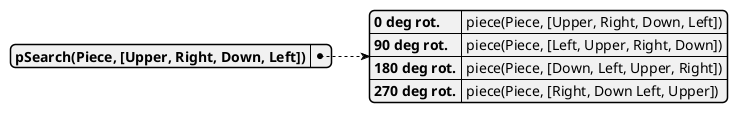
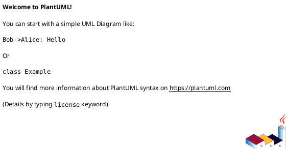

<style>
body { counter-reset: h1counter h2counter h3counter h4counter h5counter h6counter; }

h1 { counter-reset: h2counter; }
h2 { counter-reset: h3counter; }
h3 { counter-reset: h4counter; }
h4 { counter-reset: h5counter; }
h5 { counter-reset: h6counter; }
h6 {}

h2:before {
    counter-increment: h2counter;
    content: counter(h2counter) ".\0000a0\0000a0";
}

h3:before {
    counter-increment: h3counter;
    content: counter(h2counter) "." counter(h3counter) ".\0000a0\0000a0";
}

h4:before {
    counter-increment: h4counter;
    content: counter(h2counter) "." counter(h3counter) "." counter(h4counter) ".\0000a0\0000a0";
}

h5:before {
    counter-increment: h5counter;
    content: counter(h2counter) "." counter(h3counter) "." counter(h4counter) "." counter(h5counter) ".\0000a0\0000a0";
}

h6:before {
    counter-increment: h6counter;
    content: counter(h2counter) "." counter(h3counter) "." counter(h4counter) "." counter(h5counter) "." counter(h6counter) ".\0000a0\0000a0";
}

.center-div {
    text-align:center;
}

.center-image {
    display:block; 
    margin:auto;
}

.image-description {
    font-size: 11px;
}


red {
    color: rgb(255, 0, 0);
}

/* p, li, ul, code {
    font-size: 12px;
    line-height:200%;
} */


</style>


<span>AMS</span>
<br>
<br>
<br>
<br>
<br>
<br>
<br>
<br>
<br>
<br>
<br>

# Robot Desk Organizer

<br>
<br>

**Lu Knoblich, Christian Schmitz**

<br>
<br>
<br>
<div style="page-break-after: always"></div>

<font size='16px'>Table of Contents</font>

- [Robot Desk Organizer](#robot-desk-organizer)
- [Report: Autonomous workplace organizer](#report-autonomous-workplace-organizer)
  - [Introduction](#introduction)
  - [Project introduction](#project-introduction)
  - [Solution Theory (given problems and proposed solutions)](#solution-theory-given-problems-and-proposed-solutions)
    - [Object detection](#object-detection)
    - [Coordinates transformation](#coordinates-transformation)
    - [Robot controller](#robot-controller)
    - [Notes for this chapter (to be deleted later)](#notes-for-this-chapter-to-be-deleted-later)
  - [Implementation](#implementation)
    - [Object detection](#object-detection-1)
    - [Coord transition](#coord-transition)
    - [Robot arm](#robot-arm)
    - [Notes for this chapter (to be deleted later)](#notes-for-this-chapter-to-be-deleted-later-1)
  - [Results](#results)
  - [Outlook](#outlook)
  - [References for Markdown (to be deleted later)](#references-for-markdown-to-be-deleted-later)
- [Abstract](#abstract)

<div style="page-break-after: always"></div> 

<!-- 
# Table of Content
### [same content as in presentation silde](#same-content-as-in-presentation-silde)
## [References for Markdown](#references-for-markdown)
-->


# Report: Autonomous workplace organizer

## Introduction

The purpose of this project is to address the problem of an cluttered work space. The solution we developed is a robotic arm that is designed to clean up and organize the work area. 
In this report we will document and discuss the development process of the project. 

The report is comprised of three sections. The first part provides a general introduction to the Project, where the project idea as well as technology used will be addressed. The main section of this report is divided into two chapters: "Solution theory" and "Implementation".
The "Solution Theory" chapter addresses the problems that needed to be solved in order to realize the project and the corresponding theoretical solutions for these problems. 
The "Implementation" chapter provides detailed explanations of how the solutions were actually implemented and draws a comparison between the theoretical solution and the actual implementation. Finally, the last part of the report focuses on the project results and provides a conclusion, evaluating whether we have achieved our project goals and discussing further improvements for the project as well as learning outcomes. 

## Project introduction

The objective of the project is to create a robotic system capable of tidying and arranging a workspace. The design incorporates a camera that identifies objects within the area, which the robotic arm then grasps and relocates to a designated spot.

In the initial phases of the project, the decision was made to utilize a simulation rather than a physical robot. This choice was made due to the ease of testing and development in a simulated environment. The Webots simulation platform was selected for its compatibility with the project, as it is an open-source simulation platform utilized for research and education purposes. The platform is based on the ODE physics engine and the OpenGl graphics library, and offers a broad array of sensors and actuators that can be utilized to develop a robot. Furthermore, Webots integrates various existing robot-devices so that the developed controllers can be used in the real world applications. We chose to use the Irb4600 robot, which is a six-axis industrial robot that is widely used in industry. Additionally the Webots API is provided in various programming languages, including C++, Python, Java, and Matlab. Due to the machine learning and computer vision components of the project, we decided to use Python to implement the developed solution, as it is widely supported in computer vision and machine learning applications.


<div class="center-div">
  
  <p class = "image-description">Figure 1:Project setup in Webots </p>
</div>

Figure one shows the project setup in Webots. A camera is used to detect objects in the workspace. The robot-arm is equipped with a gripper that can be utilized to grasp objects. The robot and its devices are controlled by a controller that is responsible for detecting objects, determining the robot's movement, and controlling the gripper. The entire system is self contained and doesn't require human interaction, other devices or an active web connection.

The system was developed by a team of two students and divided into three main components: object detection, coordinate transformation, and robotic arm control. 


## Solution Theory (given problems and proposed solutions)

This chapter addresses the solution concepts for the problems that needed to be solved in order to realize the project and is structured according to the previously mentioned main components of the project: object detection, coordinate transformation, and robotic arm control. 
 
### Object detection
The first component of the project is the object detection. Its purpose is to detect objects in the workspace and determine their relative coordinates and size in the image as well as their orientation in relation to the table. 

To simplify these problems, we decided to use a top-down view of the workspace. This means that the camera is positioned above the workspace, so that a linear correlation between the image and the table coordinates emerges. At the early stages of project development the training of a custom object detection model was not intended and it was planned to utilize an existing model. The yolov3 model was selected due to its wide array of object classes and its high performance. 

To detect the orientation of an object relative to the table, we decided to use OpenCV, a python library used in computer vision applications which provides a broad array of functions for image processing. The main idea was to determine the contours of the object by converting the image into the HSV color space and applying different filter. The contours are then used to calculate the main orientation of the object, using principle component analysis. 

### Coordinates transformation

Once the objects are detected, the next step is to determine their coordinates in the simulation. 

- TODO: first / theoretical approach to solve problem(s)

Once knowing the coordinates of the detected object in the image, the next step is to determine the coordinates of the object in the simulation environment so that its position relative to the robot arm can be used.

This is done using a transformation matrix.
For this, it is necessary to know the dimensions, position and orientation of the table in the simulation.


Transformation matrix as a Frame <red>(not sure if this is the right term, needs to be expanded)</red>:

|Rotation matrix | Translation matrix|
|Perspective projection matrix | Scale factor|

The rotation matrix for a rotation by the angle beta around an axis given by (x,y,z) can be obtained with the following formula:

<red>Check if its right</red>

$$
\begin{bmatrix}
\cos(\beta) + x^2(1-\cos(\beta)) & xy(1-\cos(\beta)) - z\sin(\beta) & xz(1-\cos(\beta)) + y\sin(\beta) \\
xy(1-\cos(\beta)) + z\sin(\beta) & \cos(\beta) + y^2(1-\cos(\beta)) & yz(1-\cos(\beta)) - x\sin(\beta) \\
xz(1-\cos(\beta)) - y\sin(\beta) & yz(1-\cos(\beta)) + x\sin(\beta) & \cos(\beta) + z^2(1-\cos(\beta)) \\
\end{bmatrix}
$$


The translation Matrix is a 1x4 matrix containing the position vector of the tables origin relative to the simulations world origin.

The perspective projection matrix is not used in this project but is included for completeness. It is used to project a 3D point onto a 2D plane. 

The scale factor is used to to specify an uniform (isotropic) scaling factor.
Since the table is a rectangle, the scaling in the different directions is different, so a scaling matrix is used instead of a single factor as follows:
    
$$
\begin{bmatrix}
sx & 0 & 0 & 0 \\
0 & sy & 0 & 0 \\
0 & 0 & sz & 0 \\
0 & 0 & 0 & 1 \\
\end{bmatrix}
$$


where sx, sy and sz are the dimensions of the table in question.

<red> The following is not complete, needs to be reworked and checked </red>

Rotation matrix can be obtained by multiplying the three rotation matrices around the x, y and z axis. The translation matrix is used to translate the vector from the origin of the coordinate system to the desired position. The scale matrix is used to scale the vector by a given factor. The perspective projection matrix is used to project a 3D point onto a 2D plane. The scale factor is used to scale the vector by a given factor.

=========

The transformation matrix is built as follows. First, the scale factor between the image and the simulation is calculated with the tables known dimensions. 


This is done by dividing the dimensions of the table in the simulation by the dimensions of the table in the image. Knowing this, it is possible to generate a transformation matrix

Knowing this, it is possible to generate a transformation matrix 

The first step is to determine the dimensions of the table in order to calculate the scale factor between the image and the simulation. Knowing the scale factor, it is necessary to determine the position and orientation of the table, in order to complete the transformation matrix that needs to be use to calculate the coordinates of the object in the simulation.

A transformation matrix is a 4x4 matrix that is used to transform a vector from one coordinate system to another. The transformation matrix is calculated by multiplying the translation matrix, the rotation matrix, and the scale matrix. The translation matrix is used to translate the vector from the origin of the coordinate system to the desired position. The rotation matrix is used to rotate the vector around the origin of the coordinate system. The scale matrix is used to scale the vector to the desired size.


Rotation Matrix:
Column A | Column B | Column C
---------|----------|---------
$$
\begin{bmatrix}
 xx(1-cos A) + cos A   & yx(1-cos A) - z sin A & zx(1-cos A) + y sin A \\
 xy(1-cos A) + z sin A & yy(1-cos A) + cos A   & zy(1-cos A) - x sin A \\
 xz(1-cos A) - y sin A & yz(1-cos A) + x sin A & zz(1-cos A) + cos A \\
\end{bmatrix}
$$


In order to tranform the coordinates from the unit `pixels` to the unit `meters`, the scale matrix is calculated as follows:

$$
\begin{bmatrix}
 width & 0 & 0 & 0 \\
 0 & height & 0 & 0 \\
 0 & 0 & depth & 0 \\
 0 & 0 & 0 & 1 \\
\end{bmatrix}
$$

where `width`, `height`, and `depth` are the dimensions of the table in the simulation.


With the position of the table relative to the simulation origin given as (x, y, z), the translation matrix can be built as follows:  
Translation Matrix:

$$
\begin{bmatrix}
 1 & 0 & 0 & x \\
 0 & 1 & 0 & y \\
 0 & 0 & 1 & z \\
 0 & 0 & 0 & 1 \\
\end{bmatrix}
$$


The transformation matrix is then calculated by multiplying the translation matrix, the rotation matrix, and the scale matrix.??????


### Robot controller

Additionally, a robot-controller needs to be developed to control the robotic arm and the gripper.

- TODO: first / theoretical approach to solve problem(s)
  
These components will then be integrated into a single routine to detect objects, maneuver the robotic arm to the objects, and relocate the objects to a specified location.

### Notes for this chapter (to be deleted later)
- Milestones or steps needed in project development
- We define which problems we needed to solve and our first approaches to solve these problems
## Implementation 
In this chapter we will describe the implementation of the solutions proposed in the previous chapter. Additionally, there will be a comparison between the theoretical solution and the actual implementation as well as a discussion of the difficulties that were encountered during the development process. The chapter is structured according to the previously mentioned main components of the project: object detection, coordinate transformation, and robotic arm control.
### Object detection
- How the first approach turned out
  - bad accuracy 
  - not enough useable object classes 
  - no Proto files for existing object classes
  - 
- custom detection
- custom training
  - transfer learning
  - trainings data
      - randomized objects
      - labeling
      - automatization of data creation
  - training itself
    - Settings
- detection results

### Coord transition

- TODO: description of implementation Coord transition

### Robot arm

- TODO: description of implementation Robot arm
  
### Notes for this chapter (to be deleted later)
- implementation of solutions -> going into detail at interesting places 

- Structure corresponds to chapter in solution theory

- Point out differences between previously planned solutions and actual implementation

- Describe how it actually works

## Results

- TODO: presenting results

## Outlook 

- same content as in presentation silde


## References for Markdown (to be deleted later)


```prolog
piece(p01, [s00,s01,s02n,s00]).
% (...)

piece(marginLeft,[null,smargin,null,null]).
piece(margin2d,[smargin,smargin,smargin,smargin]).
piece(margin2d,[s00,smargin,smargin,smargin]).
```


This is achieved through the predicate `matchingShapes/2`, which was kept as a separate predicate to avoid the endless loops that would occur if `shapeMatch(A,B):## shapeMatch(B,A).` had been used.







|**Call \ PuzzleSize**	|10	|25	|50	|75	|100	|125	|150    |
|:---	|-:	|-:	|-:	|-:	|-:	|-:	|-:    |
|$memberchk/3	|10.40%	|24.90%	|53.00%	|71.60%	|88.00%	|89.40%	|91.30% |
|piece/2	|49.30%	|37.50%	|24.60%	|13.40%	|5.70%	|5.00%	|4.50%  |
|matchRight/6	|25.40%	|5.00%	|4.00%	|2.60%	|0.90%	|0.60%	|0.40%  |
|pieceSearch/3	|0.00%	|16.30%	|5.40%	|2.20%	|0.80%	|1.00%	|0.60%  |
|pSearch/2	|4.50%	|5.30%	|3.50%	|3.40%	|1.00%	|0.90%	|0.70%  |


# Abstract
- TODO Abstract
<div style="page-break-after: always"></div>