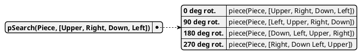
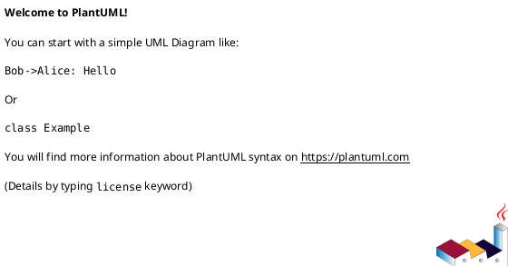

<span>Alternative computer architectures and programming languages report: Prolog</span>
<br>
<br>
<br>
<br>
<br>
<br>
<br>
<br>
<br>
<br>
<br>
# Jigsaw Puzzle Solver
<br>
<br>
<h3> Lu Knoblich </h3>
<br>
<br>
<br>
<div style="page-break-after: always"></div>


Table of contents
---
- [Jigsaw Puzzle Solver](#jigsaw-puzzle-solver)
  - [Table of contents](#table-of-contents)
  - [AMS Project Intro](#ams-project-intro)
  - [References for Markdown](#references-for-markdown)


<div style="page-break-after: always"></div>


## AMS Project Intro

## References for Markdown


```prolog
piece(p01, [s00,s01,s02n,s00]).
% (...)

piece(marginLeft,[null,smargin,null,null]).
piece(margin2d,[smargin,smargin,smargin,smargin]).
piece(margin2d,[s00,smargin,smargin,smargin]).
```


This is achieved through the predicate `matchingShapes/2`, which was kept as a separate predicate to avoid the endless loops that would occur if `shapeMatch(A,B):- shapeMatch(B,A).` had been used.







|**Call \ PuzzleSize**	|10	|25	|50	|75	|100	|125	|150    |
|:---	|-:	|-:	|-:	|-:	|-:	|-:	|-:    |
|$memberchk/3	|10.40%	|24.90%	|53.00%	|71.60%	|88.00%	|89.40%	|91.30% |
|piece/2	|49.30%	|37.50%	|24.60%	|13.40%	|5.70%	|5.00%	|4.50%  |
|matchRight/6	|25.40%	|5.00%	|4.00%	|2.60%	|0.90%	|0.60%	|0.40%  |
|pieceSearch/3	|0.00%	|16.30%	|5.40%	|2.20%	|0.80%	|1.00%	|0.60%  |
|pSearch/2	|4.50%	|5.30%	|3.50%	|3.40%	|1.00%	|0.90%	|0.70%  |

