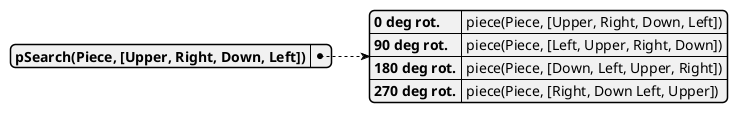
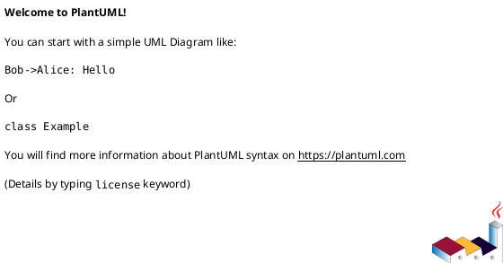

<style>
body { counter-reset: h1counter h2counter h3counter h4counter h5counter h6counter; }

h1 { counter-reset: h2counter; }
h2 { counter-reset: h3counter; }
h3 { counter-reset: h4counter; }
h4 { counter-reset: h5counter; }
h5 { counter-reset: h6counter; }
h6 {}

h2:before {
    counter-increment: h2counter;
    content: counter(h2counter) ".\0000a0\0000a0";
}

h3:before {
    counter-increment: h3counter;
    content: counter(h2counter) "." counter(h3counter) ".\0000a0\0000a0";
}

h4:before {
    counter-increment: h4counter;
    content: counter(h2counter) "." counter(h3counter) "." counter(h4counter) ".\0000a0\0000a0";
}

h5:before {
    counter-increment: h5counter;
    content: counter(h2counter) "." counter(h3counter) "." counter(h4counter) "." counter(h5counter) ".\0000a0\0000a0";
}

h6:before {
    counter-increment: h6counter;
    content: counter(h2counter) "." counter(h3counter) "." counter(h4counter) "." counter(h5counter) "." counter(h6counter) ".\0000a0\0000a0";
}

</style>


<span>AMS</span>
<br>
<br>
<br>
<br>
<br>
<br>
<br>
<br>
<br>
<br>
<br>

# Robot Desk Organizer

<br>
<br>

**Lu Knoblich, Christian Schmitz**

<br>
<br>
<br>
<div style="page-break-after: always"></div>


Table of contents
---
## [Jigsaw Puzzle Solver](#jigsaw-puzzle-solver)
### [Table of contents](#table-of-contents)
### [AMS Project Intro](#ams-project-intro)
### [References for Markdown](#references-for-markdown)


<div style="page-break-after: always"></div>


# Report: Autonomous workplace organizer


## Introduction

The purpose of this project is to address the problem of an cluttered work space. The solution we developed is a robotic arm that is designed to clean up and organize the work area. 
In this report we will document and discuss the development process of the project. 

The report is comprised of three sections. The first part provides a general introduction to the Project, where the project idea as well as technology used will be addressed. The main section of this report is divided into two chapters: "Solution theory" and "Implementation".
The "Solution Theory" chapter addresses the problems that needed to be solved in order to realize the project and the corresponding theoretical solutions to solve these problems. 
The "Implementation" chapter provides detailed explanations of how the solutions were actually implemented and draws a comparison between the theoretical solution and the actual implementation. Finally, the last part of the report focuses on the project results and provides a conclusion, evaluating whether we have achieved our project goals and discussing further improvements for the project as well as learning outcomes. 

## Project introduction

The objective of the project is to create a robotic system capable of tidying and arranging a workspace. The design incorporates a camera that identifies objects within the area, which the robotic arm then grasps and relocates to a designated spot.

In the initial phases of the project, the decision was made to utilize a simulation rather than a physical robot. This choice was made due to the ease of testing and development in a simulated environment. The Webots simulation platform was selected for its compatibility with the project, as it is an open-source simulation platform utilized for research and education purposes. The platform is based on the ODE physics engine and the OpenGl graphics library, and offers a broad array of sensors and actuators that can be utilized to develop a robot. In addition to creating your own robots, Webots integrates various existing robot-devices so that the developed controllers can be used in the real world applications. We chose to use the Irb4600 robot, which is a six-axis industrial robot that is widely used in industry. Additionally the Webots API is provided in various programming languages, including C++, Python, Java, and Matlab. Due to the machine learning and computer vision components of the project, we decided to use Python as the programming language for the project, as it is widely supported in computer vision and machine learning applications.

The project was carried out by a team of two students and divided into three main components: object detection, coordinate transformation, and robotic arm control. The initial phase involved the creation of a program that could detect objects in the workspace. The second stage included the development of an algorithm converting the detected objects' relative coordinates from the image to the simulated world coordinate system. The final phase involved the creation of a program to control the robotic arm and determine its movement. The three components were then integrated into a single routine to detect objects, maneuver the robotic arm to the objects, and relocate the objects to a specified location.


## Solution Theory (given problems and proposed solutions)

Dieses Kapitel behandelt die

This chapter addresses the problems that needed to be solved in order to realize the project and is structured 


- Milestones or steps needed in project development
- We define which problems we needed to solve and our first approaches to solve these problems
### Object detection


##### Idea how to solve problem,

- first approach

- Pros and cons

### Coord transition

##### ..

### Robot arm

##### ..

## Implementation 
- (implementation of solutions -> going into detail at interesting places )

- Structure corresponds to chapter in solution theory

- Point out differences between previously planned solutions and actual implementation

- Describe how it actually works

### Object detection

- Trainigns image creation process description


### Coord transition

#### ..

### Robot arm

#### ..

## Results

### ..

## Outlook 

### same content as in presentation silde


## References for Markdown


```prolog
piece(p01, [s00,s01,s02n,s00]).
% (...)

piece(marginLeft,[null,smargin,null,null]).
piece(margin2d,[smargin,smargin,smargin,smargin]).
piece(margin2d,[s00,smargin,smargin,smargin]).
```


This is achieved through the predicate `matchingShapes/2`, which was kept as a separate predicate to avoid the endless loops that would occur if `shapeMatch(A,B):## shapeMatch(B,A).` had been used.







|**Call \ PuzzleSize**	|10	|25	|50	|75	|100	|125	|150    |
|:---	|-:	|-:	|-:	|-:	|-:	|-:	|-:    |
|$memberchk/3	|10.40%	|24.90%	|53.00%	|71.60%	|88.00%	|89.40%	|91.30% |
|piece/2	|49.30%	|37.50%	|24.60%	|13.40%	|5.70%	|5.00%	|4.50%  |
|matchRight/6	|25.40%	|5.00%	|4.00%	|2.60%	|0.90%	|0.60%	|0.40%  |
|pieceSearch/3	|0.00%	|16.30%	|5.40%	|2.20%	|0.80%	|1.00%	|0.60%  |
|pSearch/2	|4.50%	|5.30%	|3.50%	|3.40%	|1.00%	|0.90%	|0.70%  |

